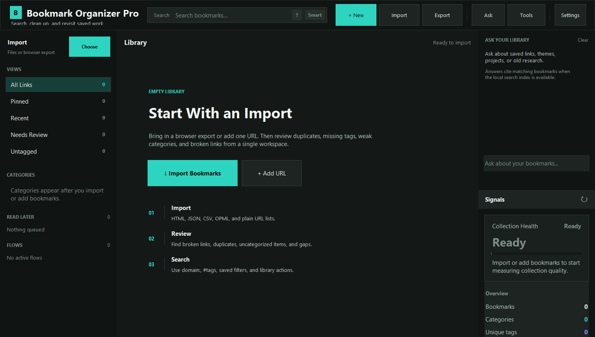

# Bookmark Organizer Pro v6.0.0

A powerful, professional-grade bookmark manager with AI-powered categorization, multi-theme support, advanced organization, **local semantic search**, **MCP server for Claude / Cursor / Codex integration**, **single-file HTML snapshots**, **research-trail flows**, and **citation-aware AI summaries**.




## What's new in v6.0.0

Major release. 18 new backend service modules and 20 new CLI subcommands.
Every new capability is gated behind optional dependencies that degrade
gracefully when missing, so the v5.x feature set keeps working with no
extra installs. See [CHANGELOG.md](CHANGELOG.md) and [docs/COMPETITIVE_RESEARCH.md](docs/COMPETITIVE_RESEARCH.md).

### v6 highlights

- **MCP server** — expose your bookmark library as a Model Context
  Protocol server. Claude Desktop, Claude Code, Cursor, and Codex can
  now `search_bookmarks`, `semantic_search`, `chat_with_collection`,
  `summarize_bookmark`, and 11 other tools directly. **No other OSS
  bookmark manager ships this.** Run with
  `python -m bookmark_organizer_pro.mcp_server`.
- **Local semantic search + hybrid RRF** — `lancedb` vector store
  fronted by an embedder chain (`fastembed` → `model2vec` →
  `sentence-transformers`). Hybrid search fuses BOP's keyword engine
  with vectors via Reciprocal Rank Fusion. All local, all optional.
- **Single-file HTML snapshots** — `monolith` (Rust) → `single-file`
  (Node) → built-in BS4 inliner fallback chain. Each snapshot is a
  portable, self-contained HTML file stored alongside the bookmark.
- **Citation-aware AI summaries** — LLM emits inline `[#cN]` tokens that
  resolve to specific text spans in the source page. Click-to-source
  highlighting in the UI; trustworthy at a glance.
- **Conversational RAG over your collection** — single-turn or chat
  history; can be restricted to a subset of bookmark IDs.
- **NL → structured query** — type `"unread Rust articles I saved last
  month"`; an LLM fills a typed query schema, validated and executed
  locally. Never runs LLM-generated SQL.
- **Tag normalization linter** — detects near-duplicate tags, casing
  drift, and singular/plural variants. Knows 14 canonical aliases.
- **Hybrid duplicate detector** — URL canonical → SimHash → embedding
  cosine, layered review queue (never auto-merges).
- **Trafilatura-based ingest** — extracts text, reading time, language,
  content type at save time. Powers the search/summary/chat features
  without LLM cost.
- **Per-bookmark ZIP exporter** (Readeck-style) — portable archive with
  metadata + notes + snapshot + extracted text.
- **Encrypted-DB toggle** — AES-256-GCM via PBKDF2-HMAC-SHA256.
- **Scheduled dead-link scanner** — background daemon, persistent queue.
- **Daily digest** — on-this-day, this-week-last-year, rediscover, read-
  later, stale-but-loved (Shaarli-inspired).
- **Flows / research trails** — ordered, annotated bookmark sequences
  (Grimoire-inspired). Different mental model from tags + folders.
- **RSS / Atom feed ingestor** — per-feed AI tagging modes (PREDEFINED /
  EXISTING / AUTO_GENERATE / DISABLED) layered on top of static default
  tags.
- **Read-later** as a first-class boolean field, not a tag.
- **5 new importers** — Pocket export, Readwise Reader CSV, Pinboard
  JSON, Instapaper CSV, Reddit Saved JSON.

### MCP setup (Claude Desktop / Claude Code / Cursor)

Add to your MCP config:

```json
{
  "mcpServers": {
    "bookmark-organizer-pro": {
      "command": "python",
      "args": ["-m", "bookmark_organizer_pro.mcp_server"]
    }
  }
}
```

After restart, the agent can query your bookmark library directly.

### v6 CLI quickstart

```bash
# Ingest, embed, then search semantically
python -m bookmark_organizer_pro.cli ingest
python -m bookmark_organizer_pro.cli embed
python -m bookmark_organizer_pro.cli hybrid "python async tutorials"

# Snapshot a bookmark to portable HTML
python -m bookmark_organizer_pro.cli snapshot 12345

# Ask the AI about your collection
python -m bookmark_organizer_pro.cli ask "what have I saved about CRDTs?"

# Detect tag drift
python -m bookmark_organizer_pro.cli lint-tags
python -m bookmark_organizer_pro.cli lint-tags --apply

# Daily digest
python -m bookmark_organizer_pro.cli digest

# Run the MCP server
python -m bookmark_organizer_pro.cli mcp-server
```

## Features

### Core Features
- **Multi-format Import**: HTML (Chrome, Firefox, Edge, Safari), JSON, CSV, OPML, TXT
- **Nested Categories**: Hierarchical category organization with drag-and-drop
- **Advanced Tagging**: User tags + AI-suggested tags with color coding
- **Premium List Workspace**: Dense, searchable bookmark table with zoom, command palette, and polished empty states
- **Full-text Search**: Advanced syntax with filters, boolean operators, and highlighting
- **Undo/Redo**: Full command history for all operations

### AI Features
- **Auto-categorization**: AI suggests categories based on URL and content
- **Tag Generation**: Automatic tag suggestions using AI
- **Title Improvement**: Clean up and improve bookmark titles
- **Content Summarization**: Generate summaries for bookmarks
- **Multiple Providers**: OpenAI, Anthropic Claude, Google Gemini, Groq, Ollama (local)

### UI/UX
- **10+ Built-in Themes**: GitHub Dark/Light, Dracula, Nord, Monokai, Tokyo Night, and more
- **Custom Themes**: Create, import, and export custom color schemes
- **High DPI Support**: Crisp rendering on high-resolution displays
- **System Tray**: Quick access without opening full window
- **Keyboard Shortcuts**: Complete keyboard navigation
- **Command Palette**: Quick access to all commands (Ctrl+P)

### Data Management
- **Automatic Backups**: Timestamped backups with easy restore
- **Export Options**: HTML, JSON, CSV, OPML, XBEL, Markdown formats
- **Soft Delete / Trash**: Recoverable deletion with trash management
- **URL Validation**: Check for broken links with concurrent checking
- **Smart Duplicate Detection**: Academic-grade URL normalization (strips 60+ tracking params, normalizes scheme/host/port/path, sorts query params)
- **Duplicate Merger**: Auto-merge duplicates keeping best title, combined tags, earliest date, summed visits
- **Favicon Caching**: Fast, cached favicon display with multi-size support

### Bookmark Intelligence
- **Health Scoring**: 0-100 health score per bookmark based on 7 factors (validity, title, tags, recency, categorization)
- **Page Metadata Fetch**: Auto-fetch title, description, and favicon from live URLs
- **Wayback Machine Integration**: Check archive.org for snapshots, submit pages for archival
- **URL Normalization**: RFC 3986 canonicalization for precise deduplication
- **4,200+ Categorization Patterns**: 32 categories covering 3,400+ domains with 768 keyword fallbacks
- **Redirect Detection**: Link checker detects and offers to fix redirected URLs
- **Batch Metadata Refresh**: Multi-threaded re-fetch of all bookmark titles/descriptions
- **Random Bookmark**: Rediscover forgotten bookmarks
- **Auto-Clean URLs**: Strip tracking params transparently on add

## Installation

### Requirements
- Python 3.8 or higher
- Tkinter (usually included with Python)

### Quick Start

```bash
# Clone or download the repository
git clone https://github.com/SysAdminDoc/Bookmark-Organizer-Pro.git
cd Bookmark-Organizer-Pro

# Run the application
python main.py
```

On first run, the application will:
1. Check for required dependencies
2. Show a dialog to install missing packages
3. Create the data directory at `~/.bookmark_organizer/`

### Dependencies

**Required** (auto-installed):
- `beautifulsoup4` - HTML parsing for bookmark import
- `requests` - HTTP requests for favicon downloads

**Optional** (recommended):
- `Pillow` - Image processing for favicons and screenshots
- `pystray` - System tray integration

### Manual Installation

```bash
pip install beautifulsoup4 requests Pillow pystray
```

## Usage

### Basic Operations

#### Adding Bookmarks
1. Click the **+ Add** button or press `Ctrl+N`
2. Enter the URL (title auto-fetched)
3. Select a category or let AI suggest one
4. Add tags (optional)
5. Click Save

#### Importing Bookmarks
1. Click **Import** or press `Ctrl+I`
2. Select your bookmark file(s)
3. Choose import options (merge duplicates, etc.)
4. Click Import

Supported formats:
- Chrome/Edge: Export as HTML from `chrome://bookmarks`
- Firefox: Export as HTML from Bookmarks Manager
- Safari: Export as HTML from File menu
- JSON: Bookmark Organizer Pro native format
- CSV: Spreadsheet format with URL, Title, Category columns

#### Searching
Use the search bar with advanced syntax:

```
python tutorial                    # Basic search
"machine learning"                 # Exact phrase
title:react                        # Search in title only
url:github.com                     # Search in URL only
tag:programming                    # Filter by tag
category:Development               # Filter by category
-deprecated                        # Exclude term
python AND tutorial                # Boolean AND
react OR vue                       # Boolean OR
```

### Keyboard Shortcuts

| Shortcut | Action |
|----------|--------|
| `Ctrl+N` | Add new bookmark |
| `Ctrl+F` | Focus search |
| `Ctrl+L` | Focus search (alternative) |
| `Ctrl+I` | Import bookmarks |
| `Ctrl+O` | Import bookmarks (alternative) |
| `Ctrl+S` | Export bookmarks |
| `Ctrl+E` | Edit selected |
| `Ctrl+A` | Select all |
| `Ctrl+Z` | Undo |
| `Ctrl+Y` | Redo |
| `Ctrl+P` | Command palette |
| `Delete` | Delete selected |
| `F5` | Refresh |
| `Escape` | Clear search / Close dialog |

### AI Configuration

1. Open the **AI** toolbar menu and choose **AI Settings**
2. Select a provider (OpenAI, Anthropic, Google, Groq, or Ollama)
3. Enter your API key if the provider requires one
4. Select a model
5. Click **Test Connection** to verify
6. Click **Save**

**Free Options:**
- **Groq**: Free tier available at [console.groq.com](https://console.groq.com)
- **Google Gemini**: Free tier at [aistudio.google.com](https://aistudio.google.com)
- **Ollama**: Run models locally (free, requires setup)

### Safety Notes

- Network tools skip private, localhost, and unsupported URL schemes to avoid leaking or fetching internal resources.
- AI API keys are stored locally in `~/.bookmark_organizer/ai_config.json`; use environment variables if you prefer not to write keys into the app config file.
- Imports, exports, settings, and category files are written defensively with atomic writes where supported.

### Theme Customization

1. Go to **Settings > Theme Settings**
2. Browse available themes
3. Click a theme to apply it
4. To create a custom theme:
   - Click **Create Custom**
   - Choose a base theme
   - Adjust colors using the color picker
   - Save with a name

## Configuration

### File Locations

| File | Location | Purpose |
|------|----------|---------|
| Bookmarks | `~/.bookmark_organizer/master_bookmarks.json` | Main bookmark data |
| Categories | `~/.bookmark_organizer/categories.json` | Category definitions |
| Tags | `~/.bookmark_organizer/tags.json` | Tag definitions |
| Settings | `~/.bookmark_organizer/settings.json` | App preferences |
| AI Config | `~/.bookmark_organizer/ai_config.json` | AI provider settings |
| Themes | `~/.bookmark_organizer/themes/` | Custom themes |
| Backups | `~/.bookmark_organizer/backups/` | Automatic backups |
| Favicons | `~/.bookmark_organizer/favicons/` | Cached favicons |
| Logs | `~/.bookmark_organizer/logs/` | Application logs |

### Settings File Format

```json
{
  "theme": "github_dark",
  "view_mode": "list",
  "show_favicons": true,
  "confirm_delete": true,
  "auto_backup": true,
  "backup_count": 10,
  "sidebar_width": 250,
  "check_urls_on_import": false
}
```

### Environment Variables

| Variable | Description |
|----------|-------------|
| `BOOKMARK_DEBUG` | Set to `1` to enable console logging |
| `BOOKMARK_DATA_DIR` | Override data directory location |

## Troubleshooting

### Common Issues

#### "Module not found" errors
```bash
# Reinstall dependencies
pip install --upgrade beautifulsoup4 requests Pillow pystray
```

#### Favicons not loading
1. Check internet connection
2. Clear favicon cache: **Tools > Clear Favicon Cache**
3. Check if domain blocks favicon requests

#### High CPU usage
- Disable URL validation on large imports
- Reduce favicon download concurrency in settings

#### Blurry text on Windows
The app should auto-detect DPI. If text is blurry:
1. Right-click the Python executable
2. Properties > Compatibility > Change high DPI settings
3. Check "Override high DPI scaling behavior"
4. Select "Application"

#### Import fails with encoding error
Try saving your bookmark file as UTF-8:
1. Open in text editor
2. Save As > Encoding: UTF-8
3. Re-import

#### AI features not working
1. Verify API key is correct
2. Check internet connection
3. Test connection in Settings > AI Configuration
4. Check logs at `~/.bookmark_organizer/logs/`

### Log Files

Enable debug logging:
```bash
# Windows
set BOOKMARK_DEBUG=1
python main.py

# macOS/Linux
BOOKMARK_DEBUG=1 python main.py
```

Log file location: `~/.bookmark_organizer/logs/bookmark_organizer.log`

### Backup and Recovery

**Create manual backup:**
- **Tools > Create Backup**

**Restore from backup:**
- **Tools > Restore from Backup**
- Select a backup file from the list
- Confirm restoration

**Automatic backups:**
- Created on every save (if enabled)
- Stored in `~/.bookmark_organizer/backups/`
- Named with timestamp: `bookmarks_backup_20260107_143052.json`

### Reset to Defaults

To completely reset the application:
```bash
# Backup your data first!
rm -rf ~/.bookmark_organizer

# On Windows:
rmdir /s %USERPROFILE%\.bookmark_organizer
```

## API Reference

### Command Line Interface

```bash
# Add a bookmark
python main.py add "https://example.com" --title "Example" --category "General"

# Search bookmarks
python main.py search "python tutorial"

# Export bookmarks
python main.py export --format html --output bookmarks.html

# Import bookmarks
python main.py import bookmarks.html

# List categories
python main.py categories

# Show statistics
python main.py stats
```

### Python API

```python
from bookmark_organizer_pro import (
    BookmarkManager,
    CategoryManager,
    TagManager,
    Bookmark
)

# Initialize managers
category_mgr = CategoryManager()
tag_mgr = TagManager()
bookmark_mgr = BookmarkManager(category_mgr, tag_mgr)

# Add a bookmark
bookmark = bookmark_mgr.add_bookmark(
    url="https://example.com",
    title="Example Site",
    category="General",
    tags=["example", "test"]
)

# Search bookmarks
results = bookmark_mgr.search("python")

# Get statistics
stats = bookmark_mgr.get_statistics()
print(f"Total bookmarks: {stats['total']}")
```

## Contributing

Contributions are welcome! Please:

1. Fork the repository
2. Create a feature branch
3. Make your changes
4. Run tests (if available)
5. Submit a pull request

### Code Style
- Follow PEP 8 guidelines
- Use type hints for function signatures
- Add docstrings to public methods
- Use the existing logging system (`log.info()`, `log.error()`, etc.)

## License

MIT License - see LICENSE file for details.

## Acknowledgments

- Theme color palettes inspired by popular editor themes
- Icons from various emoji sets
- Built with Python and Tkinter

## Version History

### v6.0.0 (April 2026)

Major release — see the **What's new in v6.0.0** section above and
[CHANGELOG.md](CHANGELOG.md) for the full list. Headlines:

- MCP server (`python -m bookmark_organizer_pro.mcp_server`) — first OSS
  bookmark manager exposed via Model Context Protocol
- Local semantic search via lancedb + fastembed/model2vec
- Hybrid keyword + semantic search via Reciprocal Rank Fusion
- Single-file HTML snapshot archiver (`monolith` / `single-file` / built-in)
- Citation-aware AI summaries with click-to-source highlights
- Conversational RAG over collections
- NL → structured query smart collections
- Tag normalization linter
- Hybrid duplicate detector (URL + SimHash + embedding)
- Trafilatura ingest pipeline (reading time, language, content type)
- Per-bookmark ZIP exporter (Readeck-style)
- Encrypted-DB toggle (AES-256-GCM + PBKDF2)
- Scheduled dead-link scanner (background daemon)
- Daily digest (on-this-day, rediscover, stale-but-loved)
- Flows / research trails (ordered, annotated bookmark sequences)
- RSS / Atom ingestor with per-feed AI tagging modes
- Read-later as a first-class field
- 5 new importers (Pocket / Readwise / Pinboard / Instapaper / Reddit Saved)
- 20 new CLI subcommands
- 5 AI clients now expose generic `complete()` for free-form generation

### v5.2.2 (April 2026)
- Reliability & UX hardening pass across 14 files
- Stricter data/config validation and defensive model `from_dict`
- Atomic persistence and safer path handling in storage
- Extra SSRF / open-redirect guards in network paths
- Hardened import/export escaping across all formats
- Category tree auto-repair on load
- Search query parser hardened against malformed input
- UI feedback paths surface errors via log/toast instead of failing silently
- Expanded regression test coverage (`tests/test_core.py` +166 lines)

### v5.2.1 (April 2026)
- Repo cleanup: renamed `bookmark_organizer_pro_v4.py` → `main.py`. The `_v4` suffix was misleading legacy from the v4.x line. The modular `bookmark_organizer_pro/` package is the canonical backend; `main.py` is the UI entry point that imports from it.
- Build spec / version_info metadata updated to reflect current version.

### v5.2.0 (April 2026)
- Fixed HTML entity display bug — imported bookmark titles like "Love, Death &amp; Robots" now correctly display "Love, Death & Robots"
- `html.unescape()` applied to titles, URLs, folder names, and tags in all HTML-parsing importers (Netscape, Pocket, Raindrop, OPML)
- Right sidebar Analytics panel widened 300 → 360px to prevent clipping at 115% default zoom
- Left sidebar widened 280 → 320px for consistent breathing room
- Zoom scaling now applies to ALL text (Tk named fonts + custom FONTS) so default launch is no longer cramped

### v5.1.0 (April 2026)
- Ollama local LLM support — server URL field + auto-detect models in AI settings
- Ollama model catalog expanded: llama3.3, qwen3, phi4, gemma3, deepseek-r1, mixtral, codellama, command-r
- Default zoom bumped 100% → 115% for better readability on high-DPI displays
- Centralized FONTS dataclass now respects zoom multiplier

### v5.0.0 (April 2026)
- 4,224 categorization patterns (3,405 domains + 768 keywords) — up from 1,963 (+115%)
- Researched top 3,000 websites via Cloudflare Radar, Similarweb, Tranco, and 11 parallel research agents
- All 32 categories at 23+ patterns, average 132 per category
- Security hardening: SSRF protection, path traversal guards, open redirect blocking, thread-safe BookmarkManager
- Premium UX: empty state, toast notifications, search placeholder, theme display names, drag-drop collapse
- 37-test suite covering Bookmark model, PatternEngine, URL normalization, SearchQuery, fuzzy match
- Removed 3,800+ lines of dead code (2 unused app classes, 2 unused FaviconManager classes, duplicate methods)
- GitHub Actions CI/CD for PyInstaller builds on Windows/macOS/Linux
- Import from Browser: auto-detect Chrome/Firefox/Edge/Brave profiles
- Atomic JSON writes for settings/tags persistence
- Favicon cache eviction (500MB limit)
- Fixed broken keyboard shortcuts (Ctrl+A, F5, Delete were never registered)
- Fixed custom theme persistence (ThemeManager load order bug)
- requirements.txt for standard pip workflows

### v4.10.0 (April 2026)
- Removed 2,558 lines of dead code (BookmarkOrganizerApp + EnhancedBookmarkOrganizerApp)
- Added `requirements.txt` for standard pip/venv workflows
- Added GitHub Actions CI/CD (PyInstaller builds for Windows/macOS/Linux on tag push)
- Import from Browser: detect and import directly from Chrome, Firefox, Edge, Brave profiles
- Search placeholder text ("Search bookmarks... Ctrl+F") with focus/blur behavior
- Theme dropdown shows display names (e.g., "GitHub Dark") instead of internal keys
- Drag-drop import area collapses to "Import more..." link after first successful import

### v4.9.0 (April 2026)
- Premium UX polish pass
- Empty state: Beautiful centered empty state with icon, heading, and CTA buttons when no bookmarks exist
- Toast notifications: Non-blocking toast system replacing modal messageboxes for import/export/link-check feedback
- Category sidebar: Count badges separated from names, proper frame-based hover on full row
- Font consistency: Replaced all hardcoded "Segoe UI" font references with centralized FONTS system
- Fixed Image.Image type hint crash when Pillow not installed
- Build metadata: Corrected author/website to SysAdminDoc/GitHub

### v4.8.0 (April 2026)
- Expanded categorization from 1,583 to 1,963 patterns (+380)
- Sports: 10 → 60 patterns (leagues, betting, fantasy, stats)
- Automotive: 9 → 60 patterns (brands, parts, reviews, repair)
- Food & Dining: 11 → 62 patterns (recipes, grocery, delivery, chains)
- Education: 17 → 64 patterns (MOOCs, textbooks, .edu catch-all, K-12)
- Social Media: 17 → 36 patterns (messaging, photo/video social)
- Added 100+ keyword fallbacks across all categories for long-tail coverage

### v4.7.0 (April 2026)
- Modular extraction phase 2: AI providers, search engine, importers, link checker, URL utilities extracted to package (~2,010 lines moved)
- Main file reduced from 22,924 to 20,914 lines
- Package now exports 83 public names
- Fixed README clone URL and added version badge
- Fixed .gitignore (removed *.spec exclusion blocking PyInstaller spec)

### v4.6.0 (April 2026)
- Expanded categorization from 150 to 894 patterns across 32 categories
- Added 5 new categories: SysAdmin & IT, Weather, Downloads & Torrents, Media Production, Software & Customization, Productivity
- Fixed PatternEngine domain matching (proper suffix matching instead of substring)
- Expanded icon mapping to 65+ keyword-to-emoji associations

### v4.1.0 (January 2026)
- Added professional dependency management UI
- Added centralized StyleManager for consistent ttk styling
- Added DPI awareness for Windows high-DPI displays
- Added comprehensive logging system
- Added enhanced status bar with counts and progress
- Added comprehensive keyboard shortcuts
- Standardized font usage across application
- Fixed duplicate class definitions
- Fixed bare except clauses
- Code quality improvements

### v4.0.0 (January 2026)
- Initial release with full feature set
- 10+ built-in themes
- AI-powered categorization and tagging
- Advanced search with boolean operators
- System tray integration
- Grid and list view modes

## Building Standalone Executable

### Prerequisites

```bash
# Install PyInstaller
pip install pyinstaller

# Install dependencies
pip install beautifulsoup4 requests Pillow pystray
```

### Build Commands

**Windows:**
```batch
# Using spec file (recommended)
pyinstaller packaging/bookmark_organizer.spec --clean --noconfirm

# Or use the build script
scripts\build_windows.bat
```

**macOS/Linux:**
```bash
# Using spec file (recommended)
pyinstaller packaging/bookmark_organizer.spec --clean --noconfirm

# Or use the build script
chmod +x scripts/build_unix.sh
./scripts/build_unix.sh
```

### Build Output

The executable will be created in the `dist/` folder:
- **Windows**: `dist/BookmarkOrganizerPro.exe`
- **macOS**: `dist/BookmarkOrganizerPro` (or .app bundle)
- **Linux**: `dist/BookmarkOrganizerPro`

### Customizing the Build

Edit `packaging/bookmark_organizer.spec` to customize:

```python
# Single file vs folder
# Default is single file. For folder, uncomment COLLECT section

# Console window
console=False  # Set to True for debugging

# UPX compression
upx=True  # Set to False if UPX not installed

# macOS app bundle
# Uncomment BUNDLE section for .app creation
```

### Build Size Optimization

The spec file already excludes unnecessary packages. For smaller builds:

1. Use UPX: Install UPX and ensure `upx=True` in spec
2. Remove unused features: Comment out unused hidden_imports
3. Strip debug info: Set `strip=True` (may cause issues on some systems)

### Icon Files

The distribution includes these icon files:
- `assets/bookmark_organizer.ico` - Windows executable icon
- `assets/bookmark_organizer.png` - Cross-platform icon (256x256)

### Code Signing (Optional)

**Windows:**
```batch
signtool sign /f certificate.pfx /p password /t http://timestamp.url dist\BookmarkOrganizerPro.exe
```

**macOS:**
```bash
codesign --deep --force --verify --verbose --sign "Developer ID" dist/BookmarkOrganizerPro.app
```

## File Manifest

| File | Description |
|------|-------------|
| `main.py` | UI entry point (Tk app). Imports backend from `bookmark_organizer_pro/` |
| `bookmark_organizer_pro/` | Modular backend package (models, core, utils, importers, AI, search, link checker, URL utils) |
| `assets/` | Source-controlled app icons and README screenshot |
| `packaging/bookmark_organizer.spec` | PyInstaller build specification |
| `packaging/version_info.txt` | Windows version metadata |
| `scripts/build_windows.bat` | Windows build script |
| `scripts/build_unix.sh` | macOS/Linux build script |
| `scripts/clean_workspace.py` | Removes generated caches/build output |
| `docs/REPOSITORY_STRUCTURE.md` | Repository layout guide |
| `docs/ARCHITECTURE.md` | Architecture boundaries and refactor map |
| `README.md` | This documentation |
