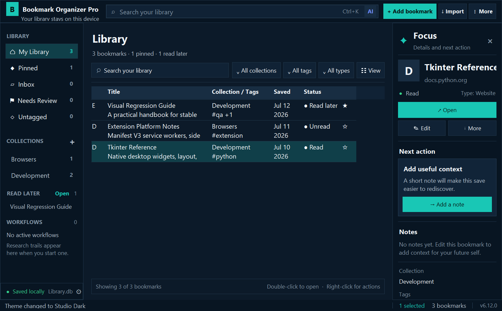

# Bookmark Organizer Pro

A powerful, professional-grade bookmark manager with AI-powered categorization, multi-theme support, advanced organization, **local semantic search**, **MCP server integration**, **verified offline snapshots**, **research-trail flows**, and **citation-aware AI summaries**.

Executable product contract: 67 CLI subcommands, 34 MCP tools, 6 AI providers, 3 extension surfaces, 59 service modules, 44 UI modules, and 53 test files.




### MCP setup

Add to your MCP config:

```json
{
  "mcpServers": {
    "bookmark-organizer-pro": {
      "command": "python",
      "args": ["-m", "bookmark_organizer_pro.mcp_server"]
    }
  }
}
```

Installed from PyPI, the same server starts with
`uvx --from "bookmark-organizer-pro[mcp]" bop-mcp`, which is the command
`packaging/server.json` declares for MCP registry clients.

After restart, the MCP-compatible client can query your bookmark library directly.
The server exposes bookmark search, semantic/hybrid retrieval, snapshots,
research flows, reader highlights, highlights due for review, per-bookmark highlight
Markdown export, and scoped reader review, note, and orphan-relink updates.
Read-only MCP tokens can list and export reader data; review recording, note
edits, and relinking require read-write scope. Streamable HTTP MCP also validates
the request Host and requires same-host
browser Origins; when MCP tokens exist, catalog, prompt, resource, and tool
operations require a bearer token. Create purpose-named, optionally expiring
MCP credentials under **Settings > Access Credentials**; each secret is shown
once, while the inventory retains only a truncated fingerprint and salted
verifier.

Reader View now saves a bounded per-bookmark position and representation digest
in a separate local sidecar. Choose Unread, In progress, or Finished, resume at
the nearest anchored passage after re-extraction, reset the position, or use
`is:in-progress` in search and the sidebar’s In Progress filter.

YouTube transcripts are always opt-in. Select an eligible bookmark and use
**Library tools > Fetch YouTube Transcript…** or the row context menu to choose a
subtitle language; the CLI exposes the same workflow as `bop transcript <id>` and
MCP provides `youtube_transcript`. Captures are bounded, stored as separate
language-specific derived text, included in content search and embedding rebuilds,
and can be removed without changing the original bookmark or extracted page text.

### Local API authentication

The bounded-concurrency local REST API requires `Authorization: Bearer <token>` for bookmark data
endpoints, including `/bookmarks`, `/search`, `/stats`, `/categories`, `/tags`,
`/digest`, `/opds`, and `/opds2`. The root endpoint only reports API metadata.
Browser-extension requests additionally require an approved extension Origin.
Saving extension settings performs the authenticated first pairing; a reinstalled
extension must use **Replace Pairing** explicitly so a different extension ID
cannot silently inherit browser access. **Settings > Access Credentials** can
issue separate REST read-only, REST read/write, or Browser extension credentials,
show their creation/last-use/expiry state, and audit allowed or denied use.
Rotate or revoke one client without interrupting unrelated integrations.
Historical local API and MCP credentials migrate into this inventory with their
existing privileges; migration never grants a broader scope.

### Local visual verification

Run the desktop and browser-extension screenshot and accessibility smokes before
shipping UI or extension changes:

```bash
python scripts/visual_regression_smoke.py
python scripts/accessibility_contract_smoke.py
python scripts/build_extension.py all
python scripts/extension_e2e_smoke.py --extension-dir build/browser-extension/chromium
python scripts/extension_firefox_smoke.py
python scripts/dependency_vulnerability_audit.py
python scripts/release_artifact_smoke.py --artifact dist/BookmarkOrganizerPro.exe
python -m bookmark_organizer_pro.i18n --check
```

The smoke writes screenshots to a temporary directory, captures Windows desktop
surfaces offscreen without activating them, exercises dark/light desktop and
MV3 extension surfaces, and fails on blank captures, missing
critical text, extension console errors, or horizontal overflow. Install
Playwright browsers once with `python -m playwright install chromium firefox`
if an extension smoke reports a missing browser runtime.
The accessibility smoke verifies extension labels, status regions, tab roles,
valid list/loading recovery structure, reduced-motion styling, Studio token
parity, and Tk keyboard-focus activation contracts.
The dependency audit checks the generated `pylock.toml` with `pip-audit --locked`, reports
actionable vulnerability IDs and fix versions, and requires every suppression in
`security/pip_audit_suppressions.json` to include package, version, ID, and
rationale.
The release artifact smoke runs the built executable with `--version` and its
headless `--release-contract` probe. It fails when the artifact is missing or
unexpectedly small, reports the wrong version, lacks bundled categories or a
declared capability, differs from its embedded dependency identity, omits its
CycloneDX SBOM, was built from dirty source, or leaves a process running.
`python scripts/package_contract_audit.py` verifies the generated install input,
standard lock, aggregate `all` extra, module ownership, and live product counts.
`packaging/release_manifest.json` records that `pylock.toml` is verified for
Windows/Python 3.11; other supported Python/platform combinations resolve the
bounded manifest and are explicitly not claimed compatible with that lock.
Regenerate the platform lock with `python scripts/package_contract_audit.py --update-lock`.
`python scripts/build_release.py` creates an isolated environment, installs the
hash-verified lock and exact build toolchain, embeds version/commit/lock/profile
identity and an SBOM, builds with PyInstaller, and runs the artifact smoke.

Before shipping from a clean checkout shell, the bounded entry-point contract
can verify imports and argument parsing without a browser, GUI, Firefox, or
release artifact:

<!-- clean-shell-contract:start -->
python scripts/build_extension.py all
python scripts/package_contract_audit.py
python -m bookmark_organizer_pro.i18n --check
python scripts/visual_regression_smoke.py --help
python scripts/accessibility_contract_smoke.py --help
python scripts/extension_e2e_smoke.py --help
python scripts/extension_firefox_smoke.py --help
python scripts/dependency_vulnerability_audit.py --help
python scripts/release_artifact_smoke.py --help
python scripts/build_release.py --help
<!-- clean-shell-contract:end -->

The browser and release smokes accept `--total-timeout`, `--phase-timeout`,
and `--artifact-dir`. They print named phases, terminate timed-out child
processes, and preserve the phase report plus captured logs/profiles in the
artifact directory when a run fails.

The localization check fails when the gettext template is stale, desktop UI
text bypasses `_()`, `N_()`, `pgettext()`, `ngettext()`, `npgettext()`, or the
named-placeholder helpers, extension copy bypasses `data-i18n`/`extensionMessage()`,
or plural and format placeholders drift. Central desktop status, toast, count,
and widget-text sinks are registered and translate their final copy; extension
checks cover both manifests, HTML titles/attributes, runtime message calls, and
Chrome substitution declarations. `qps-ploc` and `qps-plocm` pseudo-locales
expand copy for layout checks, and missing extension keys use a visible
humanized fallback instead of exposing raw identifiers. Add human translations
separately rather than generating them.

### v6 CLI quickstart

```bash
# Ingest, embed, then search semantically
python -m bookmark_organizer_pro.cli ingest
python -m bookmark_organizer_pro.cli embed
python -m bookmark_organizer_pro.cli hybrid "python async tutorials"

# Capture a bookmark as a verified offline artifact
python -m bookmark_organizer_pro.cli snapshot 12345

# Extract site-specific structured fields from supported pages
python -m bookmark_organizer_pro.cli ingest --templates extraction_templates.json 12345
python -m bookmark_organizer_pro.cli structured 12345

# Ask the AI about your collection
python -m bookmark_organizer_pro.cli ask "what have I saved about CRDTs?"

# Detect tag drift
python -m bookmark_organizer_pro.cli lint-tags
python -m bookmark_organizer_pro.cli lint-tags --apply

# Daily digest
python -m bookmark_organizer_pro.cli digest

# Run the MCP server
python -m bookmark_organizer_pro.cli mcp-server

# Create and verify a portable full-library recovery bundle
python -m bookmark_organizer_pro.cli recovery-bundle create library-recovery.zip
python -m bookmark_organizer_pro.cli recovery-bundle validate library-recovery.zip

# Restore is a dry run unless --apply is supplied
python -m bookmark_organizer_pro.cli recovery-bundle restore library-recovery.zip
python -m bookmark_organizer_pro.cli recovery-bundle restore library-recovery.zip --apply

# Export changed annotations and preflight a competitor migration
python -m bookmark_organizer_pro.cli reader export all --format json --changed-since 2026-07-01T00:00:00Z
python -m bookmark_organizer_pro.cli migration preflight linkwarden linkwarden-export.json --report fidelity.json

# Inspect bounded, local-only capture and indexing health
python -m bookmark_organizer_pro.cli jobs health
python -m bookmark_organizer_pro.cli jobs list --outcome failure --retryable

# Create and refine a validated saved collection
python -m bookmark_organizer_pro.cli smart-collections create "Python research" --tags python --domains docs.python.org,github.com
python -m bookmark_organizer_pro.cli smart-collections update <id-or-prefix> --after 2026-01-01
```

CLI commands use stable automation exit codes: `0` for success, `1` for an
operational or not-found failure, `2` for invalid usage, and `130` when
interrupted. Diagnostics are written to stderr, so stdout remains suitable for
pipes and machine-readable command output.

### Shell completions

The Bash, Zsh, and Fish files in `scripts/completions/` are generated from the
live `argparse` CLI parser, including command-specific options and choices.
Regenerate them after changing `bookmark_organizer_pro/cli.py`, or use the
check mode in CI:

```bash
python scripts/generate_completions.py
python scripts/generate_completions.py --check
```

### Performance gate

The benchmark uses bulk deterministic fixtures outside the measured regions,
then reports cold/warm startup, load, search, sort, save, dedupe, and one
incremental persisted add at 100, 1,000, and 5,000 bookmarks. Each case runs in
an isolated worker with a 10-second watchdog; the complete default gate has a
60-second budget. Use JSON for CI or local comparison:

```bash
python benchmarks/bench_core.py --gate
python benchmarks/bench_core.py --gate --json --output benchmark-report.json
```

Snapshot capture applies the same private/reserved-network, redirect, request,
time, and byte limits to Python and Playwright fetches. Monolith and SingleFile
executables cannot expose every internal request, so they are disabled by
default; set `BOOKMARK_SNAPSHOT_ALLOW_UNSAFE_EXTERNAL=1` only in a trusted
network environment to opt in.

The final response MIME and byte signature decide storage only after download.
HTML is sanitized and bundled as HTML; verified PDF, PNG, JPEG, GIF, and WebP
responses retain their original bytes and safe extension. Unsupported or
MIME-conflicting responses leave no new artifact. Each capture has a versioned
manifest containing source/final URL, MIME, SHA-256, backend, size, and UTC
timestamp; the Focus inspector and row context menu can verify and open the
offline copy, while portable ZIP exports preserve its actual format.

### Browser extension MVP

The `browser-extension/` folder contains shared Manifest V3 extension sources
that save the active HTTP/HTTPS tab through the local BOP API. Build a clean,
browser-specific unpacked directory and deterministic archive before loading it:

```bash
# Build both `build/browser-extension/{chromium,firefox}` plus ZIP/XPI archives
python scripts/build_extension.py all

# Terminal 1: keep the local API available
bop api-server --port 8765

# Terminal 2: legacy fallback-token lookup if OS keyring storage is unavailable
Get-Content "$env:USERPROFILE\.bookmark_organizer\api_token.txt"
```

Load `build/browser-extension/chromium` in Chrome/Edge or temporarily load the
`build/browser-extension/firefox` manifest in Firefox 140 or newer (Firefox for
Android needs 142, which is where the Gecko data collection disclosure the
build declares became readable), open Options, enter the
API port and a **Browser extension** credential created under
**Settings > Access Credentials**, then use the toolbar popup to save the
current tab. Existing installations can continue using the legacy API token. The
API stores tokens in the OS keyring when available and only writes the fallback
file above when keyring storage is unavailable. The extension keeps its bearer
token in a background-owned IndexedDB vault, restricts Chromium local storage
to trusted extension contexts, and migrates older `storage.local` tokens on
startup. Saving Options verifies the entered port and token with the local API
before replacing a working configuration; pairing, authentication, network, or
storage failures retain the previous settings.

Chromium uses a service worker, Side Panel, and Chrome Reading List import.
Firefox uses an ordered background page and `sidebar_action`; Firefox does not
provide `chrome.readingList`, so Reading List import reports that browser-specific
limitation while popup, sidebar, selection, and context-menu capture remain
available. Validate the Firefox manifest and a clean-profile temporary install
with `python scripts/extension_firefox_smoke.py`; set `FIREFOX_BINARY` when
Firefox is not installed in a standard or Playwright location. The smoke exits
with status 2 and a structured limitation report when no Firefox runtime exists.

Capture forms always show the effective named default category, and leaving the
field blank still sends that category through the shared save boundary. The Side
Panel search announces its waiting, loading, result-count, no-match, and error
states through a live region; its responsive layout remains usable at narrow
200% zoom-equivalent widths.

### Migrating from another service

Pocket shut down on 2025-07-08 and deleted exported data on 2025-11-12.
Pinboard's domain lapsed on 2026-06-16 with its archiving already broken.
Omnivore closed in November 2024. If you are carrying an export around from any
of them, it imports here without an account, and nothing leaves your machine.

Every path is the same three steps. Export from the old service, run the
matching import, then check the reported counts against what you expected.
Imports run as a durable session with a rollback safepoint, so a bad import can
be undone from **Tools > Import Sessions** or `bop imports`.

| Coming from | Export you need | Import with |
|---|---|---|
| Any browser | Bookmarks HTML | `bop import file.html`, or the Import Center browser cards |
| Chrome, Firefox, Edge | Nothing, the local profile is detected | Import Center browser cards |
| Firefox backups | `bookmarkbackups` .json or .jsonlz4 | `bop import-firefox-backup file.json` |
| Pocket | HTML or JSON export | `bop import-pocket file.html` |
| Pinboard | `format=json` export | `bop import-pinboard file.json` |
| Omnivore | Export .zip or unpacked folder | `bop import-omnivore export.zip` |
| Readwise Reader | CSV export | `bop import-readwise file.csv` |
| Instapaper | CSV export | `bop import-instapaper file.csv` |
| Wallabag | JSON export | `bop import-wallabag file.json` |
| Matter | CSV export | `bop import-matter file.csv` |
| Arc | StorableSidebar.json | `bop import-arc StorableSidebar.json` |
| Reddit | saved.json | `bop import-reddit saved.json` |
| Zotero | RDF export | `bop import-zotero file.rdf` |
| Raindrop, Linkwarden, Karakeep | Service export | `bop migration preflight <service> file` |
| Markwise, start.me, other CSV | Any CSV with a URL column | `bop import-csv file.csv` |
| OneTab | Exported text list | `bop import file.txt` |
| RSS subscriptions | OPML | `bop import file.opml` |

Duplicate URLs are skipped on the canonical form of the URL, so `http` versus
`https`, a `www.` prefix, a trailing slash, and tracking parameters all resolve
to the same bookmark. If you have several exports piled up, import the whole
folder at once instead of one file at a time.

### Importing a folder of exports

Years of bookmark exports usually pile up as one folder full of near-identical
files. Choose **Folder of exports** in the Import Center, or run:

```bash
python -m bookmark_organizer_pro.cli import ~/Desktop/bookmarks --dry-run
python -m bookmark_organizer_pro.cli import ~/Desktop/bookmarks
```

Every file is hashed, so byte-identical copies are read once. Each surviving
file is matched to an importer by extension and content, and entries are merged
across files on the same canonical URL the deduplicator uses, keeping the newest
date and the longest title. The preview lists files, formats, merged entries,
and field conflicts before anything is written; `--dry-run` stops there. The
import itself runs as one durable session with a single rollback safepoint.

The Firefox manifest declares Mozilla's data collection consent categories, which
Firefox shows before install. Saving a bookmark always sends its URL, title, tags,
and notes to the local API, so `bookmarksInfo` is declared as required. Page
content leaves the browser only when you tick the snapshot box on an individual
save, so `websiteContent` is declared as optional. Everything goes to the API on
your own machine at `127.0.0.1`; the extension has no other host permissions and
reports nothing to the developer. `python scripts/build_extension.py firefox`
refuses to build a manifest that omits or misdeclares these categories.

Retryable API failures from every save surface enter the same deduplicated local
journal. The popup and side panel show each pending title, source, time, and
failure reason; retries retain failures, while JSON export and confirmed Clear
with Undo protect queued work before it is discarded.

The popup and side panel can optionally save a sanitized offline copy of the
active signed-in page. Capture removes scripts, forms, event handlers, remote
assets, cookies, and storage client-side; the authenticated API enforces an
extension Origin, a versioned header, strict size/source checks, and a second
sanitization pass before atomic storage. Only embedded `data:` assets survive.
Native messaging and offline category/tag suggestions remain on the roadmap.

### Fixing sites the reader gets wrong

The content extractor handles most pages well and a handful badly: a forum
thread that keeps only the first post, a docs page where the sidebar drowns the
body. An extraction repair fixes one site by naming the element that holds the
article and the boilerplate to drop. It only ever re-reads HTML the app already
fetched, so a repair cannot reach a new origin or run page script.

Try a candidate before you keep it, using a page you have saved to disk:

```bash
bop repairs preview --url https://forum.example.com/t/123 --html thread.html \
    --keep "div.thread" --drop "aside.sidebar"
```

That prints the default and repaired character counts side by side plus the
first lines of the repaired text. When it looks right, save it:

```bash
bop repairs add --domain forum.example.com --keep "div.thread" \
    --drop "aside.sidebar" --name "Forum thread"
bop repairs list
bop repairs remove --name "Forum thread"
```

`--domain` and `--drop` are repeatable. A repair applies to a domain and its
subdomains. Selectors are ordinary CSS, capped in length, and the unbounded
`:has()`, `:contains()`, and `:matches()` forms are refused. Repairs live in
`extraction_repairs.json` in the data directory, and a repair whose selector
matches nothing, produces almost no text, or exceeds its time budget leaves the
default extraction untouched.

## Features

### Core Features
- **Multi-format Import**: HTML (Chrome, Firefox, Edge, Safari), Firefox bookmark backup JSON/JSONLZ4, JSON, CSV, OPML, TXT
- **Nested Categories**: Hierarchical category organization with drag-and-drop
- **Advanced Tagging**: User tags + AI-suggested tags with color coding
- **Premium Library Workspace**: Guided first-run capture, organization, and rediscovery actions; a dense searchable bookmark table; a contextual Focus inspector with one state-aware next action; and cohesive empty, multi-selection, and on-demand assistant states
- **Full-text Search**: Advanced syntax with filters, boolean operators, and highlighting
- **Undo/Redo**: Full command history for all operations

### AI Features
- **Auto-categorization**: AI suggests categories based on URL and content
- **Tag Generation**: Automatic tag suggestions using AI
- **Title Improvement**: Clean up and improve bookmark titles
- **Content Summarization**: Generate summaries for bookmarks
- **Evidence-Bound Answers**: Page text is passed to providers only as bounded,
  explicitly untrusted JSON evidence; assistant answers and summaries retain
  only sentences citing supplied chunk IDs
- **Versioned Local Retrieval**: Semantic indexes and answer caches are bound
  to their embedder, chunker, source, and AI configuration; stale generations
  are bypassed with a clear `bop embed` rebuild instruction
- **Multiple Providers**: OpenAI, Anthropic, Google Gemini, Groq, Ollama (local)

### UI/UX
- **10+ Built-in Themes**: GitHub Dark/Light, Dracula, Nord, Monokai, Tokyo Night, and more
- **Custom Themes**: Create, import, and export custom color schemes
- **High DPI Support**: Crisp rendering on high-resolution displays
- **Keyboard Shortcuts**: Complete keyboard navigation
- **Command Palette**: Quick access to all commands (Ctrl+P)

### Data Management
- **Automatic Backups**: Timestamped backups with easy restore
- **Scheduled Snapshots**: Persisted bookmark schedules with lifecycle recovery, pause controls, and bounded retry backoff
- **Export Options**: HTML, JSON, CSV, OPML, XBEL, Markdown formats
- **Structured Metadata Templates**: Safe JSON/YAML extraction templates capture fields for GitHub, docs, papers, videos, and store pages into bookmark metadata
- **Soft Delete / Trash**: Recoverable deletion with trash management
- **URL Validation**: Check for broken links with concurrent checking
- **Snapshot Failure Recovery**: Backend attempt reports with retry and clear actions for failed preservation runs
- **Content-Aware Offline Copies**: Verified HTML, PDF, and raster-image artifacts with digest-bound manifests, format-preserving export, and safe local opening
- **Smart Duplicate Detection**: Academic-grade URL normalization (strips 60+ tracking params, normalizes scheme/host/port/path, sorts query params)
- **Duplicate Review**: URL and smart duplicate scans open selectable cleanup previews with safepoint restore
- **Tag Cleanup Review**: Tag-lint suggestions can be selected, applied, skipped, and restored from the GUI
- **Read Later Queue**: Dedicated desktop queue for opening, reordering, completing, and removing saved read-later items
- **Resilient Reader Highlights**: Source digests plus exact quote and bounded context selectors keep highlights attached across deterministic re-extraction changes; ambiguous or missing passages remain visible as repairable orphans without losing notes, tags, or review history
- **Favicon Caching**: Fast, cached favicon display with multi-size support

### Bookmark Intelligence
- **Health Scoring**: 0-100 health score per bookmark based on 7 factors (validity, title, tags, recency, categorization)
- **Page Metadata Fetch**: Auto-fetch title, description, and favicon from live URLs
- **Wayback Machine Integration**: Check archive.org for snapshots, submit pages for archival
- **URL Normalization**: RFC 3986 canonicalization for precise deduplication
- **7,826 Categorization Patterns**: 48 categories with curated domain, keyword, and regex rules
- **Redirect Detection**: Link checker detects and offers to fix redirected URLs
- **Batch Metadata Refresh**: Multi-threaded re-fetch of all bookmark titles/descriptions
- **Random Bookmark**: Rediscover forgotten bookmarks
- **Auto-Clean URLs**: Strip tracking params transparently on add

## Installation

### Requirements
- Python 3.10 or higher
- Tkinter (usually included with Python)

### Quick Start

```bash
# Clone or download the repository
git clone https://github.com/SysAdminDoc/Bookmark-Organizer-Pro.git
cd Bookmark-Organizer-Pro

# Run the application
python main.py
```

On first run, the application will:
1. Check for required dependencies
2. Offer to install missing packages when running from Python; packaged builds instead provide deterministic reinstall guidance
3. Create the data directory at `~/.bookmark_organizer/`

### Dependencies

**Required** (auto-installed):
- `beautifulsoup4` - HTML parsing for bookmark import
- `requests` - HTTP requests for favicon downloads
- `tksheet` - virtualized Tk table for large bookmark lists

**Optional** (recommended):
- `Pillow` - Image processing for favicons and screenshots
- `lz4` - Firefox JSONLZ4 bookmark-backup import

### Manual Installation

```bash
pip install beautifulsoup4 requests tksheet "Pillow>=12.3.0" "lz4>=4.4.5,<5"
```

## Usage

### Basic Operations

#### Adding Bookmarks
1. Click the **+ Add** button or press `Ctrl+N`
2. Enter the URL (title auto-fetched)
3. Select a category or let AI suggest one
4. Add tags (optional)
5. Click Save

#### Importing Bookmarks
1. Click **Import** or press `Ctrl+I`
2. Choose the source card that matches your export or browser
3. Review the accepted file type, privacy note, duplicate policy, and next step
4. Select the file/profile and review the import summary

Supported paths:
- Chrome/Firefox/Edge: Detected local profiles when available, or bookmark HTML export
- Firefox bookmark backups: `bookmarkbackups/*.json` or `.jsonlz4`, preserving nested folders and Firefox tags
- Safari: Bookmark HTML export from File menu
- Pocket: HTML or JSON export
- Arc: `StorableSidebar.json`
- Raindrop: CSV export with collections, tags, and notes
- Readwise-compatible CSV: URL/title/tag/note/date columns
- Chrome Reading List: Browser extension side panel > Add > Reading List
- Generic files: JSON, CSV, OPML, TXT URL lists, and Netscape bookmark HTML

Browser export tips:
- Chrome/Edge: Export as HTML from `chrome://bookmarks`
- Firefox: Export as HTML from Bookmarks Manager
- Safari: Export bookmarks as HTML from File menu

#### Searching
Use the search bar with advanced syntax:

```
python tutorial                         # Adjacent clauses imply AND
"machine learning"                      # Exact phrase
title:react  url:github.com              # Field-restricted clauses
tag:programming  #python                 # Tag filter or shorthand
category:Development  domain:github.com  # Category or exact/subdomain filter
after:2026-01-01  before:2026-07-29      # ISO creation dates
is:pinned  has:notes  visits:>5          # Status/metadata filters
regex:"docs\\.example\\.com/.*api"       # Explicit time-bounded regex
-deprecated  -is:archived                # Negate any clause
python AND tutorial  react OR vue         # AND binds more tightly than OR
```

The grammar is `query := and_expr ("OR" and_expr)*`,
`and_expr := clause (("AND")? clause)*`, and
`clause := ["-"] (term | field ":" value)`. Quoted values may contain spaces.
Unknown fields, malformed dates/operators, incomplete expressions, and invalid
or over-budget regular expressions fail closed with a one-based column
diagnostic; they never broaden the result set. The same contract is used by the
desktop, CLI, REST API, and MCP tool.

#### Structured Metadata Templates
`bop ingest` applies built-in templates for common domains and can load custom
JSON/YAML templates. Extracted fields are stored locally under bookmark
metadata and appear in `bop structured`, Markdown exports, Obsidian exports, and
the detail panel.

```json
{
  "templates": [
    {
      "name": "Example docs",
      "domains": ["docs.example.com"],
      "content_type": "documentation",
      "fields": {
        "heading": { "selector": "h1" },
        "description": { "meta": "description" },
        "section": { "selector": ".breadcrumb li", "multiple": true }
      }
    }
  ]
}
```

### Keyboard Shortcuts

| Shortcut | Action |
|----------|--------|
| `Ctrl+N` | Add new bookmark |
| `Ctrl+F` | Focus search |
| `Ctrl+K` | Focus search (command-bar convention) |
| `Ctrl+L` | Focus search (alternative) |
| `Ctrl+I` | Import bookmarks |
| `Ctrl+O` | Import bookmarks (alternative) |
| `Ctrl+S` | Export bookmarks |
| `Ctrl+E` | Edit selected |
| `Ctrl+A` | Select all |
| `Ctrl+Z` | Undo |
| `Ctrl+Y` | Redo |
| `Ctrl+P` | Command palette |
| `Delete` | Delete selected |
| `F5` | Refresh |
| `Escape` | Clear search / Close dialog |

### AI Configuration

1. Open the **Ask** toolbar menu and choose **Assistant Settings**
2. Select a provider (OpenAI, Anthropic, Google, Groq, DeepSeek, or Ollama)
3. Enter your API key if the provider requires one
4. Select a model
5. Click **Test Provider** to verify
6. Click **Save Settings**

**Free Options:**
- **Groq**: Free tier available at [console.groq.com](https://console.groq.com)
- **Google Gemini**: Free tier at [aistudio.google.com](https://aistudio.google.com)
- **Ollama**: Run models locally (free, requires setup)

The Ollama setup action requires an explicit confirmation. On Windows it
downloads the pinned `v0.32.5` installer from the official GitHub release,
enforces an asset-size ceiling, verifies the embedded SHA-256 before execution,
and removes the installer afterward. On macOS and Linux the dialog provides
pinned download-and-verify commands; it never pipes a remote script to a shell.

### Safety Notes

- Network tools skip private, localhost, and unsupported URL schemes to avoid leaking or fetching internal resources.
- API and AI keys are stored in the OS keyring when available. Fallback API-token,
  AI-config, and named-credential verifier files are published atomically only
  after owner-only permissions succeed; a missing or failing Windows `icacls`
  preserves the prior credential and reports keyring/permission recovery
  guidance. Bearer secrets are shown only at creation or rotation and are never
  included in logs or support bundles.
- New encrypted stores use versioned Argon2id parameters authenticated with the ciphertext. Legacy PBKDF2 v1/v2 stores and recovery keys remain readable; rotation creates and verifies a byte-exact backup before upgrading.
- Imports, exports, settings, and category files are written defensively with atomic writes where supported.
- Annotations, flows, feeds, smart collections, jobs, and MCP verifier records use checksummed, revisioned atomic documents with recovery backups and cross-process write coordination.
- Site icons are disabled on fresh profiles. Enabling them uses cached icons and
  the bookmarked site’s own `/favicon.ico` or `/favicon.png` first; Google or
  DuckDuckGo fallback requires a separately named consent that discloses domain
  sharing, and disabling icons cancels queued fetches.
- Public page, feed, favicon, metadata, link-check, snapshot, and archive fetches share DNS-pinned connections, validated redirects, deadlines, and response ceilings. Explicitly configured AI/Ollama provider transports remain separate so local providers continue to work.

### Theme Customization

1. Go to **Settings > Theme Settings**
2. Browse available themes
3. Click a theme to apply it
4. To create a custom theme:
   - Click **Create Custom**
   - Choose a base theme
   - Adjust colors using the color picker
   - Save with a name

## Configuration

### File Locations

| File | Location | Purpose |
|------|----------|---------|
| Bookmarks | `~/.bookmark_organizer/master_bookmarks.json` | Main bookmark data |
| Categories | `~/.bookmark_organizer/categories.json` | Category definitions |
| Tags | `~/.bookmark_organizer/tags.json` | Tag definitions |
| Settings | `~/.bookmark_organizer/settings.json` | App preferences |
| AI Config | `~/.bookmark_organizer/ai_config.json` | AI provider settings and keyring-unavailable fallback |
| Themes | `~/.bookmark_organizer/themes/` | Custom themes |
| Backups | `~/.bookmark_organizer/backups/` | Automatic backups |
| Favicons | `~/.bookmark_organizer/favicons/` | Cached favicons |
| Logs | `~/.bookmark_organizer/logs/` | Application logs |

### Settings File Format

`settings.json` is a revisioned, checksummed document. The app migrates the
historical plain JSON object automatically; do not hand-edit the envelope or its
checksum. Preference values live under its `document` key, for example:

```json
{
  "schema": "bookmark-organizer-pro/settings",
  "version": 1,
  "revision": 7,
  "updated_at": "2026-07-29T14:30:00.000",
  "checksum": "<managed SHA-256>",
  "document": {
    "theme": "github_dark",
    "display_density": "comfortable",
    "accessible_bookmark_list": false,
    "favicon_display_enabled": false,
    "favicon_proxy_provider": "none"
  }
}
```

All app preference changes use revision checks. Concurrent changes to different
keys merge; a stale change to the same key is rejected and keeps the persisted
value.

### Environment Variables

| Variable | Description |
|----------|-------------|
| `BOOKMARK_DEBUG` | Set to `1` to enable console logging |
| `BOOKMARK_DATA_DIR` | Override data directory location |
| `BOOKMARK_STORAGE_BACKEND` | `json` (default) or `sqlite` |

Lookups are indexed and stay fast at any size, but the JSON backend rewrites
the whole library on every save, which is roughly a second per 25,000 bookmarks.
Past about 20,000 bookmarks, set `BOOKMARK_STORAGE_BACKEND=sqlite` so saves
write incrementally instead.

## Troubleshooting

### Common Issues

#### "Module not found" errors
```bash
# Reinstall dependencies
pip install --upgrade beautifulsoup4 requests "Pillow>=12.3.0"
```

#### Favicons not loading
1. Check internet connection
2. Clear favicon cache: **Tools > Clear Favicon Cache**
3. Check if domain blocks favicon requests

#### High CPU usage
- Disable URL validation on large imports
- Reduce favicon download concurrency in settings

#### Blurry text on Windows
The app should auto-detect DPI. If text is blurry:
1. Right-click the Python executable
2. Properties > Compatibility > Change high DPI settings
3. Check "Override high DPI scaling behavior"
4. Select "Application"

#### Import fails with encoding error
Try saving your bookmark file as UTF-8:
1. Open in text editor
2. Save As > Encoding: UTF-8
3. Re-import

#### AI features not working
1. Verify API key is correct
2. Check internet connection
3. Test connection in Settings > AI Configuration
4. Check logs at `~/.bookmark_organizer/logs/`

### Log Files

Enable debug logging:
```bash
# Windows
set BOOKMARK_DEBUG=1
python main.py

# macOS/Linux
BOOKMARK_DEBUG=1 python main.py
```

Log file location: `~/.bookmark_organizer/logs/bookmark_organizer.log`

### Diagnostics and Support Bundle

- **Help > About > Open Logs** opens the log directory.
- **Copy Diagnostics** copies allowlisted app/version/platform/dependency status and
  content-free log event fingerprints.
- **Preview Support Bundle** shows the exact four text files before anything is
  written, then lets you choose where to save the ZIP.
- Support bundles exclude bookmark titles/content, free-form log messages,
  usernames, local paths, URL paths/queries/fragments, credentials, and
  secret-like values. Website hostnames are omitted by default and can be
  included only with the named preview option.

### Backup and Recovery

**Create manual backup:**
- **Tools > Create Backup**

**Restore from backup:**
- **Tools > Restore from Backup**
- Select a backup file from the list
- Corrupt libraries enter a write-locked recovery mode instead of appearing
  empty. Restore validates a backup before unlocking; Salvage recovers complete
  records and archives the exact damaged source first.

**Restore recent maintenance changes:**
- Bulk cleanup tools create a safepoint before changing bookmark data
- Cleanup-review Apply is single-use: it disables before mutation, consumes the
  reviewed selection once, and retains the first pre-change safepoint until it is
  restored or a new maintenance workflow opens.
- **Tools > Restore Last Maintenance Safepoint** reverses the latest bulk cleanup action
- Category deletion can be restored immediately from **Manage Categories > Restore Last Delete**
- Restore and salvage operations run in the background with visible progress,
  validated terminal results, and rollback to a verified destructive safepoint.
- Category-delete safepoints survive restarts until restored or replaced.
- Imports use durable source digests and per-row checkpoints, so interrupted
  sessions can retry failures, cancel, or roll back without duplicating completed rows.
- Snapshot recapture preserves version history, redirect/status/digest provenance,
  bounded retention, and content-change reports; recovery bundles include the history.

**Automatic backups:**
- Created on every save (if enabled)
- Stored in `~/.bookmark_organizer/backups/`
- Named with timestamp: `bookmarks_backup_20260107_143052.json`

**Portable recovery bundles:**
- Include the library, categories/tags, settings, annotations/reviews, flows,
  feeds, snapshots, and extracted text with a SHA-256 manifest.
- Validation and restore dry runs do not mutate the library; they list every
  create, update, delete, and JSON/SQLite backend-switch action. Applied restores
  validate in staging, create a verified exact-state rollback checkpoint, replace
  managed files transactionally, retire the alternate backend, and reopen the
  restored fixture before reporting indexes that must be rebuilt.

### Accessibility and responsive layout

- **Settings > Accessible bookmark table** persists a native semantic table
  mode for screen readers; the choice takes effect on the next launch. Native
  and virtual modes share typed date/status/pin sorting, deterministic ties,
  named Site and Pinned columns, selected-row position and sort announcements,
  and explicit empty/loading/error state. Use **Enter** to open, **Space** to
  toggle Pinned, and **Shift+F10** for row actions and keyboard sorting.
- The contextual Focus rail collapses automatically at laptop widths and can
  be shown or hidden from **View > Focus rail**; the assistant opens on demand
  from **More > Ask your library**.
- The AI-search and AI-tag controls expose standard keyboard activation and
  visible focus. Major fixed dialogs fit the supported 1280x720 viewport with
  scrollable content and persistent action buttons.
- Desktop and extension strings have missing-key gates. `BOOKMARK_LOCALE=qps-ploc`
  expands desktop copy for layout testing; `qps-plocm` also mirrors representative RTL layouts.
- Custom and imported themes show required WCAG ratios and cannot activate when
  text, controls, or focus indicators fail the configured thresholds.

### Reset to Defaults

To completely reset the application:
```bash
# Backup your data first!
rm -rf ~/.bookmark_organizer

# On Windows:
rmdir /s %USERPROFILE%\.bookmark_organizer
```

## API Reference

### Command Line Interface

```bash
# Add a bookmark
python main.py add "https://example.com" --title "Example" --category "General"

# Search bookmarks
python main.py search "python tutorial"

# Export bookmarks
python main.py export --format html --output bookmarks.html

# Import bookmarks
python main.py import bookmarks.html

# List categories
python main.py categories

# Show statistics
python main.py stats
```

### Python API

```python
from bookmark_organizer_pro import (
    BookmarkManager,
    CategoryManager,
    TagManager,
    Bookmark
)

# Initialize managers
category_mgr = CategoryManager()
tag_mgr = TagManager()
bookmark_mgr = BookmarkManager(category_mgr, tag_mgr)

# Add a bookmark
bookmark = bookmark_mgr.add_bookmark(
    url="https://example.com",
    title="Example Site",
    category="General",
    tags=["example", "test"]
)

# Search bookmarks
results = bookmark_mgr.search("python")

# Get statistics
stats = bookmark_mgr.get_statistics()
print(f"Total bookmarks: {stats['total']}")
```

## Contributing

Contributions are welcome! Please:

1. Fork the repository
2. Create a feature branch
3. Make your changes
4. Run tests (if available)
5. Submit a pull request

### Code Style
- Follow PEP 8 guidelines
- Use type hints for function signatures
- Add docstrings to public methods
- Use the existing logging system (`log.info()`, `log.error()`, etc.)

## License

MIT License - see LICENSE file for details.

## Acknowledgments

- Theme color palettes inspired by popular editor themes
- Icons from various emoji sets
- Built with Python and Tkinter

## Building Standalone Executable

Builds, tests, vulnerability audits, visual/accessibility checks, and release
artifact smokes are run locally from this repository. The repo does not use
GitHub-hosted build or release workflows.

### Prerequisites

```bash
# Use Python 3.11 on Windows for the checked-in verified lock.
python --version
```

### Build Commands

**Windows:**
```batch
# Recreate an isolated locked environment, build, and smoke the artifact.
python scripts/build_release.py

# Convenience wrapper
scripts\build_windows.bat
```

**macOS/Linux:**
```bash
# Resolve the bounded `all` profile for the unlocked Unix target, record that
# distinction in the artifact identity, build, and smoke the artifact.
python3 scripts/build_release.py --allow-unlocked-target

# Convenience wrapper
chmod +x scripts/build_unix.sh
./scripts/build_unix.sh
```

### Build Output

The executable will be created in the `dist/` folder:
- **Windows**: `dist/BookmarkOrganizerPro.exe`
- **macOS**: `dist/BookmarkOrganizerPro` (or .app bundle)
- **Linux**: `dist/BookmarkOrganizerPro`

### Customizing the Build

Edit `packaging/bookmark_organizer.spec` to customize:

```python
# Single file vs folder
# Default is single file. For folder, uncomment COLLECT section

# Console window
console=False  # Set to True for debugging

# UPX compression
upx=True  # Set to False if UPX not installed

# macOS app bundle
# Uncomment BUNDLE section for .app creation
```

### Build Size Optimization

The spec file already excludes unnecessary packages. For smaller builds:

1. Use UPX: Install UPX and ensure `upx=True` in spec
2. Remove unused features: Comment out unused hidden_imports
3. Strip debug info: Set `strip=True` (may cause issues on some systems)

### Icon Files

The distribution includes these icon files:
- `assets/bookmark_organizer.ico` - Windows executable icon
- `assets/bookmark_organizer.png` - Cross-platform icon (256x256)

### Code Signing (Optional)

**Windows:**
```batch
signtool sign /f certificate.pfx /p password /t http://timestamp.url dist\BookmarkOrganizerPro.exe
```

**macOS:**
```bash
codesign --deep --force --verify --verbose --sign "Developer ID" dist/BookmarkOrganizerPro.app
```

## File Manifest

| File | Description |
|------|-------------|
| `main.py` | UI entry point (Tk app). Imports backend from `bookmark_organizer_pro/` |
| `bookmark_organizer_pro/` | Modular backend package (models, core, utils, importers, AI, search, link checker, URL utils) |
| `assets/` | Source-controlled app icons and README screenshot |
| `packaging/bookmark_organizer.spec` | PyInstaller build specification |
| `packaging/version_info.txt` | Windows version metadata |
| `scripts/build_windows.bat` | Windows build script |
| `scripts/build_unix.sh` | macOS/Linux build script |
| `scripts/clean_workspace.py` | Removes generated caches/build output |
| `docs/REPOSITORY_STRUCTURE.md` | Repository layout guide |
| `docs/ARCHITECTURE.md` | Architecture boundaries and refactor map |
| `README.md` | This documentation |
